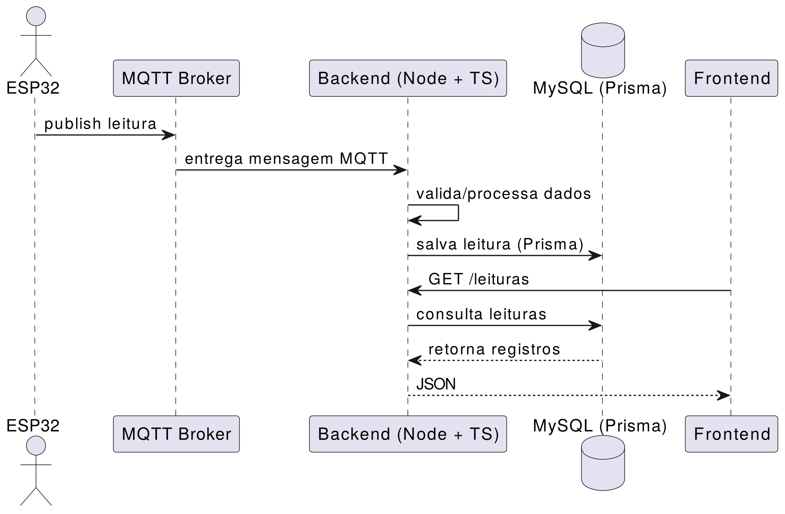

# Sistema IoT de Detecção de Gás (MQ-5 + ESP32 + MQTT + Node.js)

Este projeto é um sistema IoT completo para **detecção e monitoramento de gases inflamáveis** (GLP/Gás Natural) usando um **ESP32**, um sensor **MQ-5** e um backend em Node.js/TypeScript.

O objetivo é criar uma solução **confiável e em tempo real** para alertar sobre vazamentos de gás, tanto localmente (buzzer) quanto remotamente (MQTT + backend + banco de dados).

---
## Motivação

Vazamentos de gás são um risco real em cozinhas, oficinas e ambientes domésticos.

A ideia deste projeto é criar uma solução acessível e inteligente que:
  
- Detecta aumento perigoso de gás no ar

- Emite alerta sonoro imediato

- Envia notificações para a nuvem

- Registra tudo em um banco de dados para análise posterior

É um sistema voltado para **segurança**, **monitoramento remoto** e **aprendizado prático** sobre IoT, MQTT, backend e bancos de dados relacionais.

---
## Arquitetura Geral

A solução segue o padrão de **IoT baseado em eventos**, usando MQTT como protocolo de comunicação e uma arquitetura separada entre _Edge → Cloud_.




**Edge (Dispositivo):**

O ESP32 lê o sensor MQ-5, avalia se o valor ultrapassa o limite e envia mensagens JSON, além de ativar um buzzer.

**Cloud/Servidor:**

Um backend em Node.js assina tópicos MQTT, recebe os dados do sensor e salva no banco MySQL.

---
## O que o ESP32 faz?

  

- Lê continuamente o valor analógico do MQ-5

- Converte para nível digital (0–4095)

- Compara com um **threshold de segurança**

- Se for perigoso:

- Ativa o buzzer via PWM

- Publica mensagem MQTT como:

```json

{ "sensor_id": 1, "valor": 3200, "status": "ALERTA" }

```

---
## O que o Backend faz?

O backend (Node.js + TypeScript) é responsável por:
  
- Se conectar ao broker Mosquitto

- Assinar o tópico do sensor

- Receber as mensagens do ESP32

- Validar e interpretar o payload

- Salvar no banco MySQL usando **Prisma ORM**

- Expor uma API REST para consultar últimas leituras


Exemplo do endpoint:
```

GET /last

→ Retorna as últimas 10 leituras recebidas

```

---

## Banco de Dados


O banco MySQL registra:  

- Valor do gás

- Status (OK/ALERTA)

- Sensor do qual veio a leitura

- Tópico MQTT

- Payload completo

- Timestamp da leitura


Isto permite auditoria, histórico e futura geração de gráficos ou dashboards.

--- 
## Docker

Todo o ambiente (MySQL, Mosquitto, backend) poderá ser orquestrado usando `docker-compose`, facilitando:

- Deploy na AWS

- Reprodutibilidade

- Padronização do ambiente de execução

---

## Tecnologias Utilizadas

### **Hardware**
 
- ESP32 DevKit V1

- Sensor MQ-5

- Buzzer ativo/passivo

### **Firmware (ESP-IDF)**

- ADC One-Shot

- PWM LEDC

- FreeRTOS (tasks + queue)

- MQTT Client

### **Backend**

- Node.js

- TypeScript

- Express

- MQTT.js

- Prisma ORM

- MySQL

- Docker

---

  

## Objetivos do Projeto

- [✔] Criar um dispositivo que detecta gás em tempo real

- [✔] Gerar alerta local (buzzer)

- [✔] Enviar dados para nuvem via MQTT

- [ ] Criar backend completo com TypeScript

- [ ] Registrar histórico em banco SQL

- [ ] Dockerizar todo o sistema

- [ ] Subir para AWS EC2

- [ ] Criar painel simples de monitoramento

---

## Como rodar (versão em desenvolvimento)

_(Esta seção será atualizada conforme o backend for sendo desenvolvido.)_


```bash

npm install

npm run dev

```


Os próximos passos incluem:

- Criar `docker-compose.yml`

- Configurar Prisma

- Configurar conexão MQTT

- Criar endpoints REST

---

## Autor

**Kauan da Rosa Paulino**

Projeto acadêmico para disciplina de Introdução a Sistemas Embarcados / Banco de Dados.  

---
